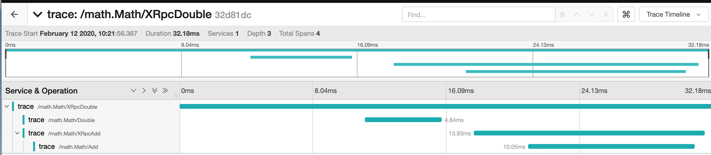

# XRPC
A Simple RPC Framework

## Requirements
- 支持proto3(定制proto-gen-go)和go interface(基于go ast解析)生成桩代码，或者直接使用函数地址Call(reflect实现)，入参和返回值都是[]byte
- 传输类型(tcp, kcp, ws, quic) x (tls, multiple stream)
- 插件系统
  - jaeger分布式链路追踪
  - prometheus监控上报
  - 特定日志
  - 连接黑白名单
  - 连接认证
  - 加密数据
  - 服务注册

## TODO
- p2p服务发现(基于chord协议)
- 多语言客户端(本地tcp连client agent->server)，主要是要修改对应的proto-gen-xxx

## Example
### 直接使用接口定义MathService
- 编写math.go定义服务接口
```go
package math

import "github.com/edenzhong7/xrpc"

type Math interface {
	XRpcAdd(ctx *xrpc.XContext, a, b int) int
	XRpcDouble(ctx *xrpc.XContext, a int) int
	Add(a, b int) int
	Double(a int) int
}
```

- 使用parser生成[math.stub.go](protocol/math/math.stub.go), 实现一个MathServer
```go
type MathImpl struct {
	math_pb.UnimplementedMath
}

func (m *MathImpl) XRpcDouble(c *xrpc.XContext, a int) int {
	time.Sleep(time.Duration(rand.Intn(10)) * time.Millisecond)
	conn, err := xrpc.Dial("tcp", serverAddr, xrpc.WithInsecure(), xrpc.WithJsonCodec())
	if err != nil {
		log.Fatalf("did not connect: %v", err)
	}

	setupConn(conn)
	client := math_pb.NewMathClient(conn)

	client.Double(c.Context(), a)
	return client.XRpcAdd(c.Context(), a, a)
}

func (m *MathImpl) XRpcAdd(c *xrpc.XContext, a, b int) int {
	time.Sleep(time.Duration(rand.Intn(10)) * time.Millisecond)
	conn, err := xrpc.Dial("tcp", serverAddr, xrpc.WithInsecure(), xrpc.WithJsonCodec())
	if err != nil {
		log.Fatalf("did not connect: %v", err)
	}

	setupConn(conn)
	client := math_pb.NewMathClient(conn)

	return client.Add(c.Context(), a, b)
}

func (m *MathImpl) Double(a int) int {
	time.Sleep(time.Duration(rand.Intn(10)) * time.Millisecond)
	return a * 2
}

func (m *MathImpl) Add(a, b int) int {
	time.Sleep(time.Duration(rand.Intn(10)) * time.Millisecond)
	return a + b
}
```

- 启动MathServer
```go
func StartMathServer(protocol, addr string) {
	lis, err := net.Listen(context.Background(), protocol, addr)
	if err != nil {
		log.Fatal(err)
	}
	s := xrpc.NewServer()
    if enablePlugin {
   		promPlugin := prom.New()
   		//logPlugin := logp.New()
   		tracePlugin := trace.New()
   		whitelistPlugin := whitelist.New(map[string]bool{"127.0.0.1": true}, nil)
   		s.ApplyPlugins(promPlugin, tracePlugin, whitelistPlugin)
   		if enableCrypto {
   			cryptoPlugin := crypto.New()
   			cryptoPlugin.SetKey(sessionID, sessionKey)
   			s.ApplyPlugins(cryptoPlugin)
   		}
   		s.StartPlugins()
   	}
   	if enableAuth {
   		admin := xrpc.NewAdminAuthenticator(user, pass)
   		s.SetAuthenticator(admin)
   	}
   	if enableAPI {
   		go api.Server(":8080")
   	}
	math_pb.RegisterMathServer(s, &MathImpl{})
	if err := s.Serve(lis); err != nil {
		log.Fatalf("failed to serve: %v", err)
	}
	s.Start()
}
```

- 创建MathClient
```go
func RunMathClient() {
    conn, err := xrpc.Dial("tcp", "localhost:9898", xrpc.WithInsecure(), xrpc.WithJsonCodec())
    if err != nil {
        log.Fatalf("did not connect: %v", err)
    }
    defer conn.Close()

    cryptoPlugin := crypto.New()
    cryptoPlugin.SetKey(sessionID, sessionKey)
    conn.ApplyPlugins(cryptoPlugin)

    // 设置auth和crypto参数
    conn.SetHeaderArg("user", user)
    conn.SetHeaderArg("pass", pass)
    conn.SetHeaderArg(crypto.Key, sessionID)
    
    client := pb.NewMathClient(conn)
    ctx :=context.Background()

    r := client.Add(ctx, 2, 3)
    assert.Equal(t, r, 5)
    
    if client == nil {
		client = newMathClient("tcp", serverAddr)
	}

	r := client.XRpcDouble(ctx, 10)
	assert.Equal(t, 20, r)    
}
```

XRpcDouble中新建client调用了实际的Double计算，测试多级rpc调用时trace能正确记录


### 直接调用服务
#### CustomServer
```go
var (
	sessionID  = "session_math_0"
	sessionKey = "1234"

	user = "admin"
	pass = "1234"
	ctx  = context.Background()
)

func setupConn(conn *xrpc.ClientConn) {
	cryptoPlugin := crypto.New()
	cryptoPlugin.SetKey(sessionID, sessionKey)
	conn.ApplyPlugins(cryptoPlugin)

	conn.SetHeaderArg("user", user)
	conn.SetHeaderArg("pass", pass)
	conn.SetHeaderArg(crypto.Key, sessionID)
}

func TestCustomServer(t *testing.T) {
	lis, s := newServer("tcp", "localhost:9898")
	s.RegisterCustomService("math", &Math{})
	s.RegisterFunction("default", "Double", func(a int) int {
		return a * 2
	})
	s.RegisterFunction("default", "RpcDouble", func(c *xrpc.XContext, a int) int {
		client, err := xrpc.NewRawClient("tcp", "localhost:9898", xrpc.WithJsonCodec())
		if err != nil {
			return 0
		}
		client.Setup(setupConn)

		var r int
		err = client.RawCall(c, "default.Double", &r, a)
		return r
	})
	if err := s.Serve(lis); err != nil {
		log.Fatalf("failed to serve: %v", err)
	}
	s.Start()
}
```
#### Client
```go
func TestCustomClientTrace(t *testing.T) {
	client, err := xrpc.NewRawClient("tcp", "localhost:9898", xrpc.WithJsonCodec())
	assert.Equal(t, nil, err)
	client.Setup(setupConn)
	var c int
	xctx := xrpc.XBackground()
	err = client.RawCall(xctx, "default.RpcDouble", &c, 10)
	assert.Equal(t, nil, err)
	assert.Equal(t, 20, c)
}
```